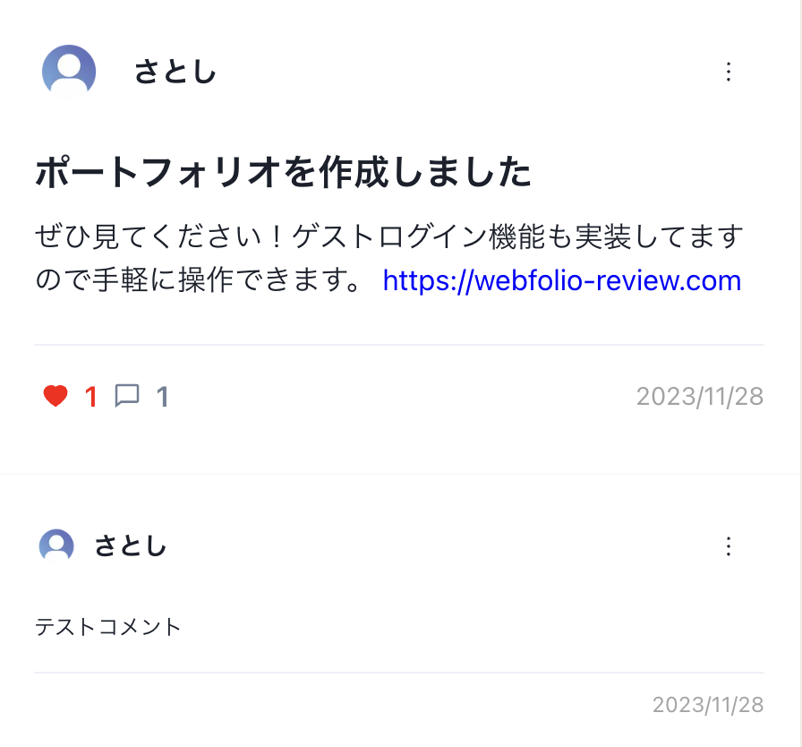

# Webfolio-Review

https://webfolio-review.com/

## 目次

- [Webfolio-Review とは](#webfolio-review-とは)
- [ページ紹介と使い方](#ページ紹介と使い方)
- [機能一覧](#機能一覧)
- [PR ポイント](#pr-ポイント)
- [使用技術](#使用技術)
- [インフラ構成図](#インフラ構成図)
- [今後の課題](#今後の課題)

## Webfolio-Review とは

このポートフォリオは、Web エンジニアとして未経験から転職を目指す方々に特化して開発しました。多くの場合、ポートフォリオは企業の評価のみを受ける形となりますが、そのような状況では UI のバグや改善が必要な点を抱えたまま企業に見られてしまう可能性が高いです。そのため、このプロジェクトでは同じ境遇の方々にも事前に評価していただくことを目的とし、結果としてより高品質なポートフォリオに仕上げられるように努力しています。

さらに、他人のポートフォリオを閲覧することで、新たな機能やデザインのアイデアを得ることができるため、相互作用を促進するプラットフォームとしても機能します。

## ページ紹介と使い方

### 共通要素:投稿カード

投稿カードには以下の機能が含まれています

- **ユーザーの投稿一覧ページへのリンク**: ユーザーヘッダーをクリックするとそのユーザーの投稿が一覧で見れるページにアクセスできます。
- **投稿詳細ページへのリンク**: 投稿ボディをクリックするとその投稿の詳細ページにアクセスできます。
- **いいね機能**: ログイン済みの場合、いいねボタンをクリックするといいねをしたり取り消したりできます。
- **コメント機能**: ログイン済みの場合、コメントボタンをクリックするとコメントできます。

### 共通要素:ヘッダー

ヘッダーには以下の機能が含まれています

- **投稿作成**: 「投稿を作成」ボタンをクリックすると投稿を作成するためのモダールが開きます。ユーザーはここで投稿のタイトル、内容を入力して投稿することができます。ログイン時のみ表示されます。
- **マイアクティビティへのリンク**: ドロップダウンメニューからログアウトボタンと各アクティビティへのリンクがありどのページからでも各アクティビティに簡単にアクセスできます。ログイン時にのみ表示されます。
- **ユーザーのログイン、新規作成**: どのページからでもログイン、新規登録ページにアクセスできます。非ログイン時にのみ表示されます。

### トップページ

- **機能**: 最新の投稿 3 件と人気投稿 3 件を一覧で見ることができます。ログインしていない場合はアカウント新規作成、ゲストログインへのボタンが表示されています。

### /auth/sign_in

- **機能**: サインインすることができます。ログイン済みの場合アクセス不可。

### /auth/sign_up

- **機能**: アカウントを新規作成することができます。ログイン済みの場合アクセス不可。

### /users/account

- **機能**: ユーザー情報を編集、ユーザーを削除することができます。未ログインの場合アクセス不可。

### /users/likes

- **機能**: ユーザーがいいねした投稿を一覧で見ることができます。未ログインの場合アクセス不可。

### /users/:id/posts

- **機能**: 特定のユーザーの投稿を一覧で見ることができます。

### /posts

- **機能**: 投稿を最新順で一覧を見ることができます。投稿をクリックするとその投稿の個別ページにアクセスします。

### /posts/:id

投稿の個別ページです。

## 機能一覧

| 機能                       | 説明                                                                                                                                      |
| -------------------------- | ----------------------------------------------------------------------------------------------------------------------------------------- |
| ログイン機能               | サインイン、サインアップ、ゲストログイン、ログアウト                                                                                      |
| ユーザー情報編集機能       | ユーザーの名前、アイコンを編集できます(ゲストログイン時は不可)。アカウントの削除も可能です。                                              |
| 投稿機能                   | 投稿することができます。投稿ユーザー本人の場合編集削除が可能です。                                                                        |
| 投稿閲覧機能               | 投稿を閲覧することができます。/posts から投稿をクリックすると投稿の個別ページに飛びその投稿にされているコメントも閲覧することが可能です。 |
| いいね機能                 | 投稿に対していいねをすることができます。                                                                                                  |
| コメント機能               | 投稿に対してコメントすることができます。コメントユーザー本人の場合編集削除が可能です。                                                    |
| いいね数上位の投稿閲覧機能 | 人気投稿トップ 3 件を確認できます。                                                                                                       |
| マイアクティビティ機能     | ユーザーが自分の投稿やいいねした投稿に簡単にアクセスできる機能です。個人のアクティビティを一覧で追跡できます。                            |

## PR ポイント

- **SPA 方式の採用**: シングルページアプリケーション（SPA）方式を採用することで、ユーザー体験を向上させました。ページ遷移の速度が向上し、より滑らかなインタラクションが可能になりました。

- **Next.js 13（appDir）の採用**: 2023 年 5 月に安定版となった`appDir`を採用しました。新機能であり日本語の情報が非常に少なかったため、GitHub のコード検索や海外の掲示板を活用して実装を行いました。

- **ゲストログイン機能**: ユーザーがアプリケーションの主要な機能を簡単に試せるように、ゲストログイン機能を実装しました。

- **条件付きページ遷移**: ログイン状況に応じて、特定のページへのアクセス時に強制的に遷移する仕組みを実装しました。これにより、不正アクセスやバグの発生を防ぐことができました。

- **API レスポンスの最適化**: バックエンドで gem "alba"を用いて API レスポンスを整形しました。不必要なデータを削除することで、セキュリティ上の危険性を軽減しました。

- **デバウンスの導入**: いいね機能にデバウンスを導入しました。これにより、短時間の多重リクエストを減らし、データベースへの負荷を軽減しました。

- **テストの充実**: フロントエンドでは Jest を、バックエンドでは RSpec を使用して各機能に対するテストを実装しました。これにより、コードの堅牢性を確保し、バグの発見と修正が容易になりました。

- **単体テストによる関心の分離**: フロントエンドではほぼ全ての機能・コンポーネントに対して単体テストを実装しました。これにより、関心の分離が明確化され、コードの可読性が大幅に向上しました。

- **コード品質の確保**: フロントエンドでは ESLint と Prettier、バックエンドでは Rubocop を導入しました。これらのリンターとフォーマッターを用いることで、コードの可読性と一貫性を高め、開発効率を向上させました。

## 使用技術

### フロントエンド

- Next.js(13.4.6, appDir)
- TypeScript
- ChakraUI
- Jest

### バックエンド

- RailsAPI(7.0.5)
- NginX
- RSpec

### データベース

- MySQL

### CI/CD

- GitHub Actions

### その他

- Docker
- AWS

## インフラ構成図

## 今後の課題

- **管理者機能の実装**: 現在、不適切な投稿を削除するにはデータベースを直接操作するしかありません。この運用は非効率であり、リスクも伴います。そのため、投稿の管理をより効率的かつ安全に行う管理者機能の実装を検討中です。具体的な方法としては、管理者専用のダッシュボードを同一アプリケーション内に設けるか、あるいはセキュリティを重視して独立した管理者用アプリケーションを開発するかの選択肢を評価しています。

- **通知機能の実装**: 現在、ユーザーが自陣の投稿に対する「いいね」や「コメント」を確認するためには「自分の投稿」から確認するしかなく効率性に欠けます。そのため通知機能の実装を検討中です。この機能により、ユーザーは自身の投稿に新しい「いいね」や「コメント」がある際に、リアルタイムで通知を受け取ることができるようになります。通知機能の導入によって、ユーザーは即座に反応を確認し、より活発にコミュニティ内での交流を楽しむことが可能になります。
